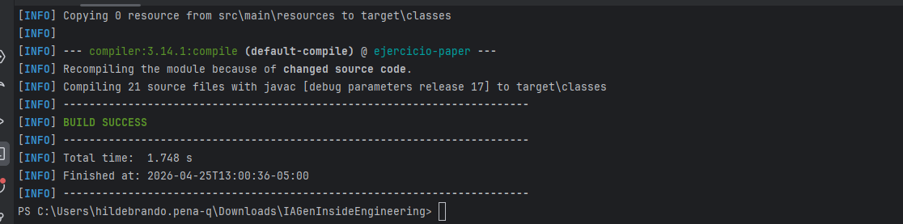

Tengo un ejercicio de diseño de software en Java. Necesito un sistema de videoclub llamado 'Videoclub Don Mario' que cumpla lo siguiente: registrar películas físicas o digitales con disponibilidad, permitir al cliente seleccionar películas por número, calcular el precio total según membresía (BASICA = precio normal, PREMIUM = 20% descuento), y mostrar un recibo detallado. Las películas son: [Fisica] Interestellar $8000 disponible, [Fisica] El Padrino $7000 no disponible, [Digital] Inception $5000 disponible, [Digital] Matrix $6000 disponible. Aplica patrones de diseño apropiados (Strategy, Template Method o similares), principios SOLID, polimorfismo y encapsulamiento. Genera el código Java organizado en paquetes: model, service, enums.

RESPUESTADE LA IA 
tiempo 10 minutos 
Patrones de Diseño Identificados
1. Strategy (patrón principal)
   El cálculo del precio varía según la membresía del cliente. En lugar de usar if/else para cada tipo, el enum TipoMembresia encapsula la estrategia de descuento correspondiente. Cada valor del enum lleva su propio porcentaje, y CalculadorPrecio lo consume sin saber qué tipo es.
2. Template Method (implícito en la jerarquía de Pelicula)
   La clase abstracta Pelicula define el esqueleto del comportamiento (getTitulo(), getPrecio(), toString()), y las subclases PeliculaFisica y PeliculaDigital solo implementan el método variable: getTipo().
3. Single Responsibility aplicado como separación de servicios
   CalculadorPrecio y GeneradorRecibo son clases de servicio independientes, cada una con una única responsabilidad.

ESTRUCTURA DEL PROYECTO
videoclub/
└── src/main/java/videoclub/
├── enums/
│   └── TipoMembresia.java
├── model/
│   ├── Pelicula.java          ← clase abstracta
│   ├── PeliculaFisica.java
│   └── PeliculaDigital.java
├── service/
│   ├── CalculadorPrecio.java
│   └── GeneradorRecibo.java
└── VideoClubApp.java          ← main

Tengo un sistema de pagos en Java con las clases ECIPayment, PaymentMethod (abstracta), PaymentObserver (interfaz), CreditCardFactory, PaypalFactory, CryptoFactory, Notification, Inventory, Facturation, PaymentEventObserver y PaymentStatus. El sistema usa patrones Factory y Observer. Analiza el código, identifica errores de compilación, clases faltantes, mal uso de patrones y propón correcciones. El error principal es que PaymentFactory no existe como interfaz y las factories extienden PaymentMethod en lugar de implementar una interfaz factory.
❌ Errores Identificados
Error 1 — PaymentFactory no existe
ECIPayment.processPayment() recibe un parámetro de tipo PaymentFactory pero esa interfaz nunca fue creada. Es el error principal de compilación.
Error 2 — Las factories extienden PaymentMethod en lugar de implementar PaymentFactory
CreditCardFactory, PaypalFactory y CryptoFactory extienden PaymentMethod (clase abstracta de dominio). Esto viola el patrón Factory: una factory no ES un método de pago, sino que CREA métodos de pago.
Error 3 — PaymentEventObserver importa javax.management.Notification
javaimport javax.management.Notification; // ❌ incorrecto — es la clase del JDK, no la del proyecto
Debería usar la clase Notification del paquete propio, que no necesita import porque está en el mismo paquete.
Error 4 — ValidatePayment no existe como interfaz separada
PaymentMethod declara implements ValidatePayment pero esa interfaz no fue pegada. Debe existir.
Error 5 — Bug en constructor de PaymentMethod
javapublic PaymentMethod(double amount, String transactionID, String description) {
this.customerID = customerID; // ❌ asigna el parámetro "transactionID" con nombre incorrecto
El parámetro se llama transactionID pero se intenta asignar customerID que no existe en el scope.
Error 6 — CryptoFactory aparece duplicado en el código
El archivo CryptoFactory.java está pegado dos veces. No afecta compilación si solo hay un archivo, pero indica descuido.
Error 7 — Product no fue compartido
Inventory usa Product pero no se ve su implementación. Debe existir.
tiempó 13 minutos 
